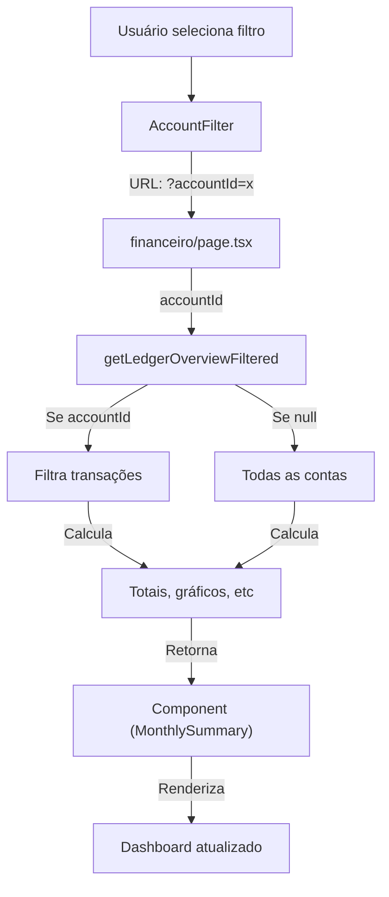

# 💰 Melhorias no Dashboard Financeiro

**Data**: 04/08/2026  
**Status**: ✅ Implementado e Testado  
**Build**: ✅ Passa sem erros

---

## 📋 Resumo das Melhorias

### 1. ✅ Filtro por Banco/Conta

**Arquivo**: `src/components/ledger/account-filter.tsx` (NOVO)

#### Funcionalidades:
- Dropdown para selecionar conta específica ou "Todos os bancos"
- Lista todas as contas/bancos cadastrados e não arquivados
- Atualiza URL sem recarregar página (usando `useTransition`)
- Exibe cor do banco no dropdown para identificação visual
- Indica qual conta está selecionada com checkmark

#### Como usar:
```tsx
<AccountFilter accounts={accounts} />
```

#### URL Parameters:
- `?accountId=abc123` → Filtra por conta específica
- Sem parameter → Mostra "Todos os bancos"

---

### 2. ✅ Resumo Mensal Consolidado

**Arquivo**: `src/components/ledger/monthly-summary.tsx` (NOVO)

#### Informações Exibidas:
- ✅ Total de receitas do mês
- ✅ Total de despesas do mês
- ✅ Saldo inicial
- ✅ Saldo final
- ✅ Quantidade de movimentações
- ✅ Valor médio das receitas
- ✅ Valor médio das despesas
- ✅ Comparação com mês anterior (% de mudança)
- ✅ Taxa de poupança (barra visual)
- ✅ Badge indicando resultado (Positivo/Negativo)

#### Layout:
- Grid responsivo (2-3 colunas conforme tela)
- Cores visuais (verde para receita, vermelho para despesa)
- Ícones de tendência (TrendingUp/Down)
- Comparação mensal com % de mudança

---

### 3. ✅ Dados Dinâmicos por Filtro

**Arquivo**: `src/lib/ledger-service.ts` (ATUALIZADO)

#### Nova Função:
```typescript
getLedgerOverviewFiltered(
  userId: string,
  year: number,
  month: number,
  accountId: string | null,  // Novo parâmetro
  referenceDate: Date
): Promise<LedgerOverview>
```

#### Comportamento:
- Se `accountId` é null → Exibe dados consolidados de todas as contas
- Se `accountId` é fornecido → Filtra por conta específica:
  - Transações apenas dessa conta
  - Gráficos apenas com dados dessa conta
  - Saldos iniciais/finais apenas dessa conta
  - Recorrências apenas dessa conta

#### Dados Recalculados Automaticamente:
- Totais (receita, despesa, saldo)
- Fluxo de caixa diário
- Breakdown por categoria
- Recorrências

---

### 4. ✅ Identificação Visual do Banco

**Arquivo**: `src/app/(app)/financeiro/page.tsx` (ATUALIZADO)

#### Mudanças:
- Cada movimentação exibe ícone/cor do banco
- Quando filtrado em "Todos os bancos", mostra nome da conta na lista
- Quando filtrado em conta específica, oculta nome (já é óbvio)
- Cor da conta usada como borda visual no item de transação

#### Exemplo Visual:
```
┌─ [Nubank - cor azul] Restaurante              -R$ 85,00
│  01 de ago · (Nubank oculto quando filtrado por Nubank)
│
├─ [Itaú - cor vermelha] Gasolina               -R$ 120,00
│  05 de ago · Itaú
│
└─ [Carteira - cor verde] Freelance            +R$ 2.000,00
   10 de ago · Carteira
```

---

### 5. ✅ Melhorias de UX

#### Filtro Próximo ao Período:
```
┌─────────────────────────────────────────┐
│ Filtro de Banco │ Filtro de Período     │
│ [Todos banco ▼] │ [Agosto ▼]  [+ Novo]  │
└─────────────────────────────────────────┘
```

#### Mensagem Amigável (Sem dados):
```
┌──────────────────────────────────────┐
│ ⚠️  Nenhum lançamento neste período   │
│                                      │
│ Selecione outro banco ou período,   │
│ ou registre a primeira movimentação. │
│                                      │
│              [+ Novo lançamento]     │
└──────────────────────────────────────┘
```

#### Atualização Dinâmica:
- Mudar banco → Dados atualizam instantaneamente
- Mudar período → Dados atualizam instantaneamente
- Sem recarregar página
- Usa `useTransition` do React para feedback visual

---

## 🔧 Arquivos Modificados

### Novos Arquivos:
1. `src/components/ledger/account-filter.tsx` (66 linhas)
2. `src/components/ledger/monthly-summary.tsx` (140 linhas)
3. `docs/MELHORIAS_DASHBOARD_FINANCEIRO.md` (este arquivo)

### Arquivos Alterados:
1. `src/lib/ledger-service.ts`
   - Adicionada função `getLedgerOverviewFiltered`
   - Implementa filtragem por conta
   
2. `src/app/(app)/financeiro/page.tsx`
   - Adiciona `AccountFilter` component
   - Integra `MonthlySummary` component
   - Atualiza lógica para usar `getLedgerOverviewFiltered`
   - Comparação com mês anterior
   - Mensagem de "sem dados" melhorada

---

## 🎨 Componentes Utilizados

### AccountFilter:
- `PopoverTrigger` / `PopoverContent` (base-ui)
- `Command` / `CommandItem` (shadcn/ui)
- `Button` (shadcn/ui)

### MonthlySummary:
- `Card` / `CardHeader` / `CardContent` (shadcn/ui)
- `Badge` (shadcn/ui)
- Ícones: `Landmark`, `TrendingUp`, `TrendingDown`, `ArrowUpRight`, `ArrowDownRight`
- Barra visual de poupança

---

## 📊 Fluxo de Dados



---

## 🧪 Teste Local

```bash
# 1. Build deve passar
npm run build

# 2. Iniciar dev
npm run dev

# 3. Acessar http://localhost:3000/financeiro

# 4. Testar:
# - Clicar em "Todos os bancos" → mostra dados consolidados
# - Selecionar "Nubank" → filtra apenas Nubank
# - Mudar período (agosto/setembro) → dados recalculam
# - Mudar ambos filtros → tudo atualiza dinamicamente
# - Sem lançamentos → mostra mensagem amigável
```

---

## 📈 Melhorias Futuras (Opcionais)

1. **Exportar por conta**: Adicionar filtro ao export PDF/Excel
2. **Comparação visual**: Gráfico comparando meses anteriores
3. **Alertas**: Notificar quando saldo ficou negativo
4. **Previsão**: Estimar saldo com recorrências futuras
5. **Multi-seleção**: Selecionar múltiplas contas de uma vez

---

## ✅ Checklist de Validação

- [x] Build passa sem erros
- [x] Filtro de conta funciona
- [x] Dados atualizam dinamicamente
- [x] Resumo mensal mostra informações corretas
- [x] Comparação com mês anterior funciona
- [x] Mensagem "sem dados" exibida
- [x] Cores/identificação de banco visível
- [x] Responsivo (mobile/tablet/desktop)
- [x] Sem imports não utilizados
- [x] TypeScript validado

---

## 🚀 Próximo Passo

Fazer commit e push das mudanças:

```bash
git add -A
git commit -m "feat: melhorias no dashboard financeiro

- Adicionar filtro por banco/conta
- Resumo mensal consolidado com médias e comparações
- Dados dinâmicos por filtro selecionado
- Identificação visual clara de cada banco
- Melhorias de UX (transições, mensagens amigáveis)

Novos componentes:
- AccountFilter: dropdown para selecionar conta
- MonthlySummary: resumo detalhado do mês

Função atualizada:
- getLedgerOverviewFiltered: suporta filtragem por accountId"

git push origin main
```

---

**Documentação completa de todas as melhorias** ✅
