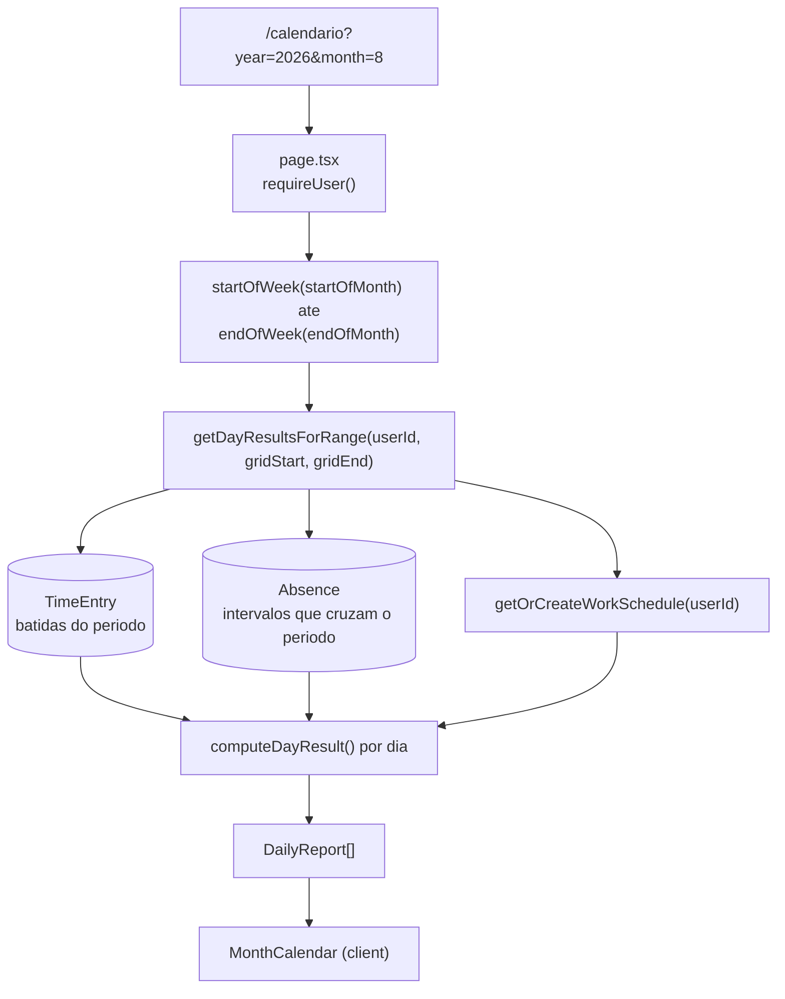
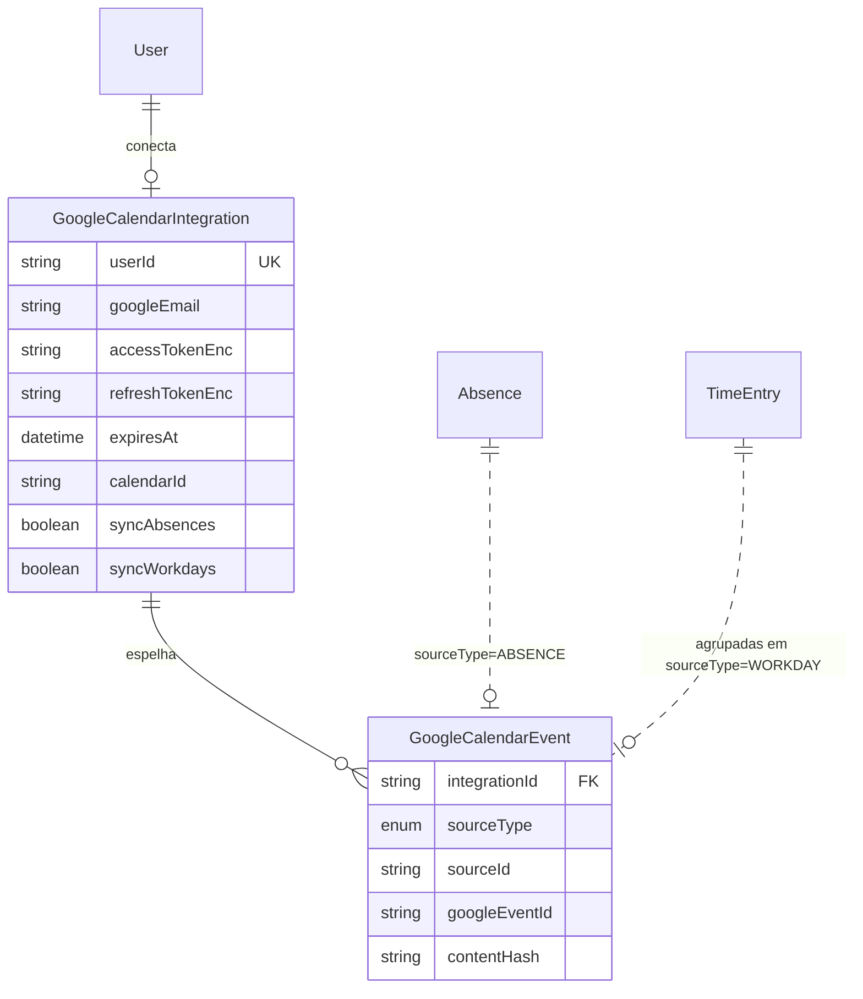
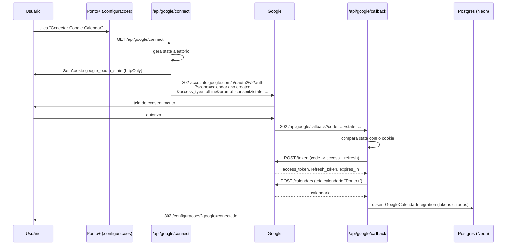
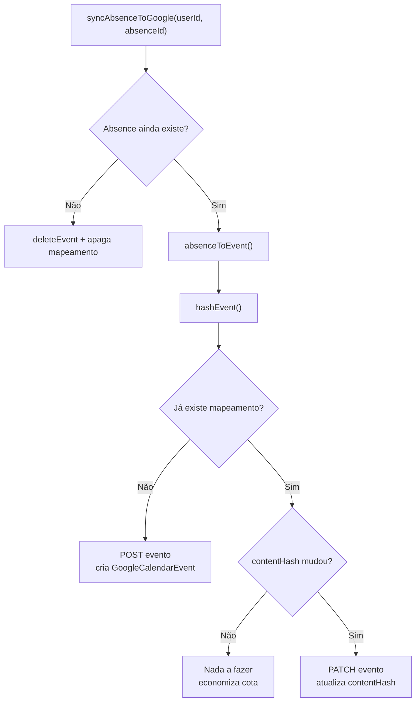

# Integração com o Google Calendar

Guia de implementação para sincronizar o calendário do **Ponto+** com o Google Calendar.

Este documento descreve uma funcionalidade **ainda não implementada**. Tudo que se refere ao sistema atual está marcado como *estado atual* e foi verificado no código; o restante é o projeto da integração, com os arquivos exatos a criar ou alterar.

---

## Índice

1. [Estado atual do calendário](#1-estado-atual-do-calendário)
2. [Decisões de arquitetura](#2-decisões-de-arquitetura)
3. [O que sincronizar](#3-o-que-sincronizar)
4. [Pré-requisitos no Google Cloud](#4-pré-requisitos-no-google-cloud)
5. [Variáveis de ambiente](#5-variáveis-de-ambiente)
6. [Dependências](#6-dependências)
7. [Modelo de dados](#7-modelo-de-dados)
8. [Criptografia dos tokens](#8-criptografia-dos-tokens)
9. [Fluxo OAuth 2.0](#9-fluxo-oauth-20)
10. [Camada de serviço](#10-camada-de-serviço)
11. [Mapeamento de dados](#11-mapeamento-de-dados)
12. [Armadilhas de fuso horário](#12-armadilhas-de-fuso-horário)
13. [Quando sincronizar](#13-quando-sincronizar)
14. [Idempotência](#14-idempotência)
15. [Sincronização reversa](#15-sincronização-reversa-google--ponto)
16. [Interface de configuração](#16-interface-de-configuração)
17. [Erros e limites de uso](#17-erros-e-limites-de-uso)
18. [Desconectar e revogar](#18-desconectar-e-revogar)
19. [Checklist de implementação](#19-checklist-de-implementação)
20. [Testes](#20-testes)
21. [Impacto na arquitetura](#21-impacto-na-arquitetura)

---

## 1. Estado atual do calendário

### 1.1 Arquivos envolvidos

| Arquivo | Responsabilidade |
|---|---|
| `src/app/(app)/calendario/page.tsx` | Server Component da rota `/calendario`. Lê `year`/`month` da query string, calcula a grade do mês e renderiza. |
| `src/components/calendar/month-calendar.tsx` | Componente de apresentação da grade mensal. Recebe `CalendarDay[]`. |
| `src/lib/time-service.ts` | `getDayResultsForRange(userId, start, end)` — carrega batidas e ausências e devolve um resultado por dia. |
| `src/lib/time-calc.ts` | Camada pura. `computeDayResult()` decide status, minutos trabalhados, extras e déficit. |
| `prisma/schema.prisma` | Modelos `TimeEntry`, `Absence`, `WorkSchedule`. |

### 1.2 Como os dados chegam na tela



Ponto importante: **a grade cobre semanas inteiras**, não só o mês. `page.tsx` usa `startOfWeek(monthStart)` e `endOfWeek(monthEnd)`, então dias do mês anterior e seguinte entram na consulta. Qualquer sincronização baseada na tela precisa considerar isso, ou sincronizará dias fora do mês por engano.

### 1.3 As três fontes de dado

**`TimeEntry`** — uma batida individual.

```prisma
model TimeEntry {
  date      DateTime     // dia à meia-noite local
  type      EntryType    // ENTRADA | SAIDA_ALMOCO | RETORNO_ALMOCO | SAIDA
  time      DateTime     // data + hora completa do evento
  source    EntrySource  // MANUAL | PONTO_RAPIDO | IMPORTACAO | AJUSTE
}
```

Um dia completo gera **4 registros**. Isso importa muito na decisão do que exportar (seção 3).

**`Absence`** — ausência, possivelmente com intervalo.

```prisma
model Absence {
  date     DateTime
  endDate  DateTime?     // preenchido em férias/licença
  type     AbsenceType   // FALTA_JUSTIFICADA | FALTA_INJUSTIFICADA | BANCO_HORAS
                         // | FOLGA | FERIAS | LICENCA | COMPENSACAO | HOME_OFFICE
  impact   AbsenceImpact // NEUTRO | DESCONTA | ABATE_BANCO | NAO_DESCONTA
  approved Boolean
}
```

**`WorkSchedule`** — jornada esperada (`entryTime`, `exitTime`, `workDays`, `dailyHours`). Usada para calcular o previsto, não para gerar eventos.

### 1.4 Status possíveis de um dia

`DayStatus`, em `src/lib/time-calc.ts:21`:

```
COMPLETO | HORA_EXTRA | INCOMPLETO | FALTA_NAO_REGISTRADA | FALTA_JUSTIFICADA
FALTA_INJUSTIFICADA | FERIAS | LICENCA | FOLGA | BANCO_HORAS | COMPENSACAO
HOME_OFFICE | EM_ANDAMENTO
```

### 1.5 O que ainda não existe

- **Nenhum route handler.** `src/app/api/` existe mas está vazio. O callback do OAuth será o primeiro `route.ts` do projeto.
- Nenhuma dependência de HTTP externo. Toda escrita passa por Server Actions.
- Nenhum campo de token ou credencial de terceiros no schema.

---

## 2. Decisões de arquitetura

### 2.1 Direção da sincronização

| Direção | Complexidade | Risco | Recomendação |
|---|---|---|---|
| **Ponto+ → Google** | Baixa | Baixo | ✅ **Comece por aqui** |
| Google → Ponto+ | Média | Médio — precisa interpretar eventos livres | Fase 2, opcional |
| Bidirecional | Alta | Alto — exige resolução de conflito | Só se houver necessidade real |

O motivo de começar unidirecional é concreto: no modo Ponto+ → Google, **o Ponto+ é a única fonte de verdade**. Não existe conflito possível — se o Google divergir, o Ponto+ sobrescreve. Assim que a sincronização vira bidirecional, é preciso decidir o que fazer quando a mesma férias foi editada nos dois lados, e essa decisão não tem resposta boa sem carimbo de versão em ambos.

### 2.2 Calendário dedicado, não o principal

A integração deve **criar um calendário próprio** chamado `Ponto+` na conta do usuário, em vez de escrever no calendário principal.

Três razões:

1. **Menor privilégio.** Permite usar o escopo `calendar.app.created`, que dá acesso apenas aos calendários criados pelo próprio app. O Ponto+ nunca enxerga compromissos pessoais do usuário.
2. **Reversibilidade.** Desconectar = apagar um calendário. Sem risco de remover evento que não era nosso.
3. **Controle de exibição.** O usuário liga e desliga a camada no Google Calendar com um clique.

O `calendarId` retornado na criação fica salvo em `GoogleCalendarIntegration.calendarId` (seção 7).

---

## 3. O que sincronizar

### 3.1 Comparação das opções

| Fonte | Volume | Valor no Google Calendar | Recomendado |
|---|---|---|---|
| `Absence` (férias, folga, home office) | ~10–30 eventos/ano | **Alto** — é compromisso real de agenda | ✅ Sim |
| Resumo do dia trabalhado | ~250 eventos/ano | Médio — útil para ver a jornada | ⚠️ Opcional |
| `TimeEntry` individual | ~1000 eventos/ano | **Baixo** — 4 eventos minúsculos por dia | ❌ Não |
| Jornada prevista (`WorkSchedule`) | ~250/ano | Baixo — é rotina fixa, polui | ❌ Não |

### 3.2 Recomendação

Duas chaves independentes na configuração:

- **`syncAbsences`** (padrão `true`) — cada `Absence` vira um evento de dia inteiro.
- **`syncWorkdays`** (padrão `false`) — cada dia com batidas vira **um** evento, da primeira à última batida.

Exportar `TimeEntry` individualmente é o erro clássico: gera quatro eventos de um minuto por dia, torna a agenda ilegível e multiplica por quatro o consumo da cota da API sem entregar informação que o resumo diário já não dê.

---

## 4. Pré-requisitos no Google Cloud

### 4.1 Criar o projeto e habilitar a API

1. Acesse [console.cloud.google.com](https://console.cloud.google.com)
2. **New Project** → nome `Ponto+`
3. **APIs & Services → Library** → busque **Google Calendar API** → **Enable**

### 4.2 Tela de consentimento

**APIs & Services → OAuth consent screen**

| Campo | Valor |
|---|---|
| User Type | **External** (ou Internal, se houver Google Workspace) |
| App name | `Ponto+` |
| User support email | seu e-mail |
| Authorized domains | `vercel.app` (e o domínio próprio, se houver) |

**Escopo a adicionar:**

```
https://www.googleapis.com/auth/calendar.app.created
```

Esse escopo concede acesso **somente aos calendários criados pelo app**. É o de menor privilégio que atende ao caso e evita a verificação pesada do Google exigida pelos escopos sensíveis de calendário completo.

> Se em algum momento for necessário ler a agenda existente do usuário (sincronização reversa da seção 15), aí sim entra `https://www.googleapis.com/auth/calendar.readonly`, que é **escopo sensível** e exige processo de verificação do Google antes de sair do modo de teste.

Enquanto o app estiver em **Testing**, adicione os e-mails que vão usá-lo em **Test users** — sem isso o consentimento falha.

### 4.3 Credenciais OAuth

**APIs & Services → Credentials → Create Credentials → OAuth client ID**

- Application type: **Web application**
- Name: `Ponto+ Web`

**Authorized redirect URIs** — cadastre as duas:

```
http://localhost:3000/api/google/callback
https://ponto-psi-taupe.vercel.app/api/google/callback
```

> A URI precisa bater **exatamente**, incluindo esquema, host, porta e caminho. Divergência aqui produz `redirect_uri_mismatch`, que é o erro mais comum dessa integração. Se você adicionar domínio próprio depois, cadastre também a URI dele.

Guarde o **Client ID** e o **Client secret**.

---

## 5. Variáveis de ambiente

### 5.1 Novas variáveis

| Nome | Onde obter | Exemplo |
|---|---|---|
| `GOOGLE_CLIENT_ID` | Credentials do Google Cloud | `1234-abc.apps.googleusercontent.com` |
| `GOOGLE_CLIENT_SECRET` | Credentials do Google Cloud | `GOCSPX-...` |
| `GOOGLE_REDIRECT_URI` | Deve bater com o cadastrado | `https://ponto-psi-taupe.vercel.app/api/google/callback` |
| `GOOGLE_TOKEN_ENCRYPTION_KEY` | Gerar (abaixo) | 64 caracteres hex |

Gerar a chave de criptografia:

```bash
node -e "console.log(require('crypto').randomBytes(32).toString('hex'))"
```

### 5.2 Arquivos a alterar

**`.env`** (local, ignorado pelo git) e **`.env.example`** (versionado, só placeholders):

```bash
# Integração com Google Calendar
GOOGLE_CLIENT_ID=""
GOOGLE_CLIENT_SECRET=""
GOOGLE_REDIRECT_URI="http://localhost:3000/api/google/callback"
# 32 bytes em hex — gere com:
# node -e "console.log(require('crypto').randomBytes(32).toString('hex'))"
GOOGLE_TOKEN_ENCRYPTION_KEY=""
```

### 5.3 Cadastro na Vercel

```bash
vercel env add GOOGLE_CLIENT_ID production
vercel env add GOOGLE_CLIENT_SECRET production
vercel env add GOOGLE_REDIRECT_URI production
vercel env add GOOGLE_TOKEN_ENCRYPTION_KEY production
```

Repita para `preview` e `development`. Atenção: em `preview` a `GOOGLE_REDIRECT_URI` aponta para um domínio diferente a cada deploy, então o OAuth **não funciona em preview** sem um domínio fixo. O caminho prático é testar OAuth apenas em `localhost` e em produção.

> **Nunca** troque a `GOOGLE_TOKEN_ENCRYPTION_KEY` depois que houver tokens salvos — todos se tornam indecifráveis e cada usuário precisa reconectar. Se precisar rotacionar, faça um script que descriptografe com a chave antiga e recriptografe com a nova, dentro de uma transação.

---

## 6. Dependências

```bash
npm i google-auth-library
```

Apenas isso. O pacote `googleapis` completo tem dezenas de megabytes porque embute o cliente de **todas** as APIs do Google — num ambiente serverless isso infla o bundle da função e piora o cold start. O `google-auth-library` cuida do fluxo OAuth e da renovação do token, e as chamadas ao Calendar são REST simples via `fetch`, que o Node 24 já tem nativo.

---

## 7. Modelo de dados

### 7.1 Novos enums e modelos

Adicione ao final de `prisma/schema.prisma`:

```prisma
// ---------------------------------------------------------------------------
// Integração com Google Calendar.
// Espelha o padrão do módulo financeiro: modelos isolados, sem alterar o
// significado de nenhuma tabela existente do controle de ponto.
// ---------------------------------------------------------------------------

/// Origem, no Ponto+, de um evento espelhado no Google.
enum GoogleSyncSource {
  ABSENCE  // uma linha de Absence
  WORKDAY  // o resumo de um dia com batidas
}

/// Conexão de UM usuário com UMA conta Google.
/// Um usuário só conecta uma conta por vez — daí o @unique em userId.
model GoogleCalendarIntegration {
  id     String @id @default(cuid())
  user   User   @relation(fields: [userId], references: [id], onDelete: Cascade)
  userId String @unique

  /// E-mail da conta Google conectada. Exibido na tela de configurações para
  /// o usuário saber qual conta está vinculada.
  googleEmail String

  /// Tokens SEMPRE criptografados em repouso (AES-256-GCM). Ver
  /// src/lib/crypto.ts. O refresh token vale indefinidamente e permite emitir
  /// access tokens novos: vazá-lo equivale a entregar a agenda do usuário.
  accessTokenEnc  String
  refreshTokenEnc String
  /// Quando o access token expira. Renovado proativamente antes de cada uso.
  expiresAt       DateTime

  /// Calendário dedicado criado pelo app na conta do usuário.
  /// Null significa que a conexão existe mas o calendário ainda não foi criado.
  calendarId String?

  syncAbsences Boolean @default(true)
  syncWorkdays Boolean @default(false)

  /// Token de sincronização incremental do Google (fase 2, seção 15).
  syncToken String?

  lastSyncAt    DateTime?
  lastSyncError String?
  active        Boolean   @default(true)

  createdAt DateTime @default(now())
  updatedAt DateTime @updatedAt

  events GoogleCalendarEvent[]
}

/// Ponte entre uma entidade do Ponto+ e o evento correspondente no Google.
///
/// Sem esta tabela não há como atualizar nem apagar um evento já criado — a
/// API do Google exige o eventId. É também o que torna a sincronização
/// idempotente: rodar duas vezes não duplica nada.
model GoogleCalendarEvent {
  id            String                    @id @default(cuid())
  integration   GoogleCalendarIntegration @relation(fields: [integrationId], references: [id], onDelete: Cascade)
  integrationId String

  sourceType GoogleSyncSource
  /// Absence.id quando ABSENCE; a data em ISO (yyyy-MM-dd) quando WORKDAY.
  sourceId   String

  googleEventId String

  /// Hash do conteúdo já enviado. Se o hash não mudou, a sincronização pula a
  /// chamada de update — economiza cota da API e evita escrita inútil.
  contentHash String

  syncedAt DateTime @updatedAt

  /// Uma origem gera no máximo um evento por integração.
  @@unique([integrationId, sourceType, sourceId])
  /// E um evento do Google pertence a no máximo uma origem.
  @@unique([integrationId, googleEventId])
  @@index([integrationId, sourceType])
}
```

### 7.2 Relação em `User`

Em `model User`, acrescente:

```prisma
  googleCalendar GoogleCalendarIntegration?
```

### 7.3 Auditoria

Em `enum AuditEntity`, acrescente:

```prisma
  GOOGLE_INTEGRATION
```

E em `src/app/(app)/historico/page.tsx`, no mapa `ENTITY_LABELS`:

```ts
  GOOGLE_INTEGRATION: "Integração Google Calendar",
```

> Esse mapa é `Record<AuditEntity, string>`. Se você adicionar o valor no enum e esquecer do rótulo, **o TypeScript quebra o build** — proposital, para o histórico nunca exibir um enum cru.

### 7.4 Diagrama



Note que a ligação de `Absence` e `TimeEntry` com `GoogleCalendarEvent` é **lógica, não uma foreign key**. Isso é intencional: `sourceId` guarda tipos diferentes conforme `sourceType` (um cuid de `Absence` ou uma data para `WORKDAY`), o que uma FK não comporta. O preço é que apagar uma `Absence` não remove a linha em cascata — a limpeza é responsabilidade do serviço de sincronização (seção 13.2).

### 7.5 Migration

```bash
npx prisma migrate dev --name add_google_calendar_integration
```

Em produção a migration é aplicada pelo `buildCommand` do `vercel.json`, que já roda `prisma migrate deploy` com a conexão direta do Neon.

---

## 8. Criptografia dos tokens

Crie **`src/lib/crypto.ts`**:

```ts
import { createCipheriv, createDecipheriv, randomBytes } from "crypto";

/**
 * Criptografia simétrica para segredos de terceiros em repouso.
 *
 * AES-256-GCM em vez de CBC porque GCM é autenticado: adulterar o texto
 * cifrado faz a decifragem falhar em vez de devolver lixo silenciosamente.
 *
 * Formato do texto cifrado: iv:authTag:dados, tudo em base64url. O IV é
 * aleatório por operação — reutilizar IV em GCM quebra a garantia do modo.
 */

const ALGORITHM = "aes-256-gcm";

function getKey() {
  const hex = process.env.GOOGLE_TOKEN_ENCRYPTION_KEY;
  if (!hex) {
    throw new Error(
      "GOOGLE_TOKEN_ENCRYPTION_KEY nao definida. Gere com: node -e \"console.log(require('crypto').randomBytes(32).toString('hex'))\""
    );
  }
  const key = Buffer.from(hex, "hex");
  if (key.length !== 32) {
    throw new Error("GOOGLE_TOKEN_ENCRYPTION_KEY deve ter 32 bytes (64 caracteres hex)");
  }
  return key;
}

export function encryptSecret(plain: string): string {
  const iv = randomBytes(12); // 96 bits: tamanho recomendado para GCM
  const cipher = createCipheriv(ALGORITHM, getKey(), iv);
  const data = Buffer.concat([cipher.update(plain, "utf8"), cipher.final()]);
  const tag = cipher.getAuthTag();
  return [iv, tag, data].map((b) => b.toString("base64url")).join(":");
}

export function decryptSecret(payload: string): string {
  const [ivB64, tagB64, dataB64] = payload.split(":");
  if (!ivB64 || !tagB64 || !dataB64) {
    throw new Error("Token criptografado em formato invalido");
  }
  const decipher = createDecipheriv(ALGORITHM, getKey(), Buffer.from(ivB64, "base64url"));
  decipher.setAuthTag(Buffer.from(tagB64, "base64url"));
  return Buffer.concat([
    decipher.update(Buffer.from(dataB64, "base64url")),
    decipher.final(),
  ]).toString("utf8");
}
```

> Esse módulo usa `node:crypto`, então só roda em runtime Node. Como o projeto não declara `export const runtime = "edge"` em lugar nenhum (verificado), todas as rotas já são Node por padrão. Não introduza Edge nas rotas que tocam esse arquivo.

---

## 9. Fluxo OAuth 2.0

### 9.1 Visão geral



### 9.2 `src/app/api/google/connect/route.ts`

```ts
import { randomBytes } from "crypto";
import { cookies } from "next/headers";
import { NextResponse } from "next/server";
import { requireUser } from "@/lib/auth";

const GOOGLE_AUTH_URL = "https://accounts.google.com/o/oauth2/v2/auth";
const SCOPE = "https://www.googleapis.com/auth/calendar.app.created";
const STATE_COOKIE = "google_oauth_state";

/**
 * Inicia o consentimento OAuth.
 *
 * O parametro `state` existe contra CSRF: sem ele, um atacante poderia induzir
 * o navegador da vitima a completar um callback com um `code` da conta DELE,
 * vinculando a conta Google do atacante ao usuario logado. Guardamos o valor
 * num cookie httpOnly e conferimos no callback.
 */
export async function GET() {
  const user = await requireUser();

  const state = randomBytes(32).toString("base64url");
  const cookieStore = await cookies();
  cookieStore.set(STATE_COOKIE, state, {
    httpOnly: true,
    secure: process.env.NODE_ENV === "production",
    sameSite: "lax", // "lax" permite o cookie voltar no redirect do Google
    path: "/",
    maxAge: 600, // 10 minutos: o consentimento nao deve demorar mais que isso
  });

  const params = new URLSearchParams({
    client_id: process.env.GOOGLE_CLIENT_ID!,
    redirect_uri: process.env.GOOGLE_REDIRECT_URI!,
    response_type: "code",
    scope: SCOPE,
    // offline: necessario para receber refresh_token
    access_type: "offline",
    // consent: forca nova emissao de refresh_token mesmo se o usuario ja
    // autorizou antes. Sem isso, uma reconexao devolve so o access token e a
    // integracao para de funcionar em 1 hora.
    prompt: "consent",
    state,
    login_hint: user.email,
  });

  return NextResponse.redirect(`${GOOGLE_AUTH_URL}?${params}`);
}
```

### 9.3 `src/app/api/google/callback/route.ts`

```ts
import { cookies } from "next/headers";
import { NextResponse, type NextRequest } from "next/server";
import { prisma } from "@/lib/prisma";
import { requireUser } from "@/lib/auth";
import { logAudit } from "@/lib/audit";
import { encryptSecret } from "@/lib/crypto";
import { createDedicatedCalendar } from "@/lib/google-calendar-service";

const STATE_COOKIE = "google_oauth_state";

function redirectTo(request: NextRequest, status: string) {
  return NextResponse.redirect(new URL(`/configuracoes?google=${status}`, request.url));
}

export async function GET(request: NextRequest) {
  const user = await requireUser();
  const url = new URL(request.url);

  // O usuario pode ter clicado em "Cancelar" na tela do Google.
  const error = url.searchParams.get("error");
  if (error) return redirectTo(request, "cancelado");

  const code = url.searchParams.get("code");
  const state = url.searchParams.get("state");

  const cookieStore = await cookies();
  const expectedState = cookieStore.get(STATE_COOKIE)?.value;
  cookieStore.delete(STATE_COOKIE); // uso unico

  if (!code || !state || !expectedState || state !== expectedState) {
    return redirectTo(request, "estado_invalido");
  }

  // Troca do code pelos tokens.
  const tokenResponse = await fetch("https://oauth2.googleapis.com/token", {
    method: "POST",
    headers: { "Content-Type": "application/x-www-form-urlencoded" },
    body: new URLSearchParams({
      code,
      client_id: process.env.GOOGLE_CLIENT_ID!,
      client_secret: process.env.GOOGLE_CLIENT_SECRET!,
      redirect_uri: process.env.GOOGLE_REDIRECT_URI!,
      grant_type: "authorization_code",
    }),
  });

  if (!tokenResponse.ok) return redirectTo(request, "falha_token");

  const tokens = (await tokenResponse.json()) as {
    access_token: string;
    refresh_token?: string;
    expires_in: number;
  };

  // Sem refresh_token a integracao morre quando o access token expira.
  // Acontece se o usuario ja autorizou antes e o prompt=consent falhou.
  if (!tokens.refresh_token) return redirectTo(request, "sem_refresh_token");

  // Descobre o e-mail da conta conectada.
  const userInfo = await fetch("https://www.googleapis.com/oauth2/v2/userinfo", {
    headers: { Authorization: `Bearer ${tokens.access_token}` },
  });
  const { email: googleEmail } = (await userInfo.json()) as { email: string };

  const calendarId = await createDedicatedCalendar(tokens.access_token);

  const expiresAt = new Date(Date.now() + tokens.expires_in * 1000);
  const data = {
    googleEmail,
    accessTokenEnc: encryptSecret(tokens.access_token),
    refreshTokenEnc: encryptSecret(tokens.refresh_token),
    expiresAt,
    calendarId,
    active: true,
    lastSyncError: null,
  };

  await prisma.googleCalendarIntegration.upsert({
    where: { userId: user.id },
    create: { userId: user.id, ...data },
    update: data,
  });

  await logAudit({
    userId: user.id,
    entity: "GOOGLE_INTEGRATION",
    entityId: user.id,
    action: "CREATE",
    after: { googleEmail, calendarId },
    reason: "Conexao com Google Calendar",
  });

  return redirectTo(request, "conectado");
}
```

> **Erros de OAuth nunca devem virar exceção 500 na cara do usuário.** Todos os caminhos de falha acima redirecionam para `/configuracoes` com um código legível, e a tela traduz para uma mensagem. Uma tela de erro do Next no meio de um fluxo de consentimento é péssima experiência e não diz o que fazer.

---

## 10. Camada de serviço

Crie **`src/lib/google-calendar-service.ts`**, seguindo a divisão que o projeto já usa: `*-service.ts` fala com o mundo externo e com o banco; a matemática pura fica separada (como `time-calc.ts` e `ledger-calc.ts`).

```ts
import { prisma } from "@/lib/prisma";
import { decryptSecret, encryptSecret } from "@/lib/crypto";

const CALENDAR_API = "https://www.googleapis.com/calendar/v3";
/** Fuso fixo da aplicação. Ver seção 12 — jamais usar o fuso do servidor. */
export const APP_TIMEZONE = "America/Sao_Paulo";

/**
 * Devolve um access token válido, renovando quando necessário.
 *
 * A renovação é PROATIVA (60s de folga) em vez de reativa ao 401: numa função
 * serverless, tratar o 401 significa uma ida e volta extra à API a cada
 * chamada perto do vencimento.
 */
async function getAccessToken(userId: string): Promise<{ token: string; calendarId: string }> {
  const integration = await prisma.googleCalendarIntegration.findUnique({ where: { userId } });
  if (!integration || !integration.active) throw new Error("INTEGRACAO_INATIVA");
  if (!integration.calendarId) throw new Error("CALENDARIO_NAO_CRIADO");

  const stillValid = integration.expiresAt.getTime() - Date.now() > 60_000;
  if (stillValid) {
    return { token: decryptSecret(integration.accessTokenEnc), calendarId: integration.calendarId };
  }

  const response = await fetch("https://oauth2.googleapis.com/token", {
    method: "POST",
    headers: { "Content-Type": "application/x-www-form-urlencoded" },
    body: new URLSearchParams({
      client_id: process.env.GOOGLE_CLIENT_ID!,
      client_secret: process.env.GOOGLE_CLIENT_SECRET!,
      refresh_token: decryptSecret(integration.refreshTokenEnc),
      grant_type: "refresh_token",
    }),
  });

  if (!response.ok) {
    // O usuario pode ter revogado o acesso pelo painel da conta Google.
    // Desativamos a integracao para parar de tentar e sinalizar na UI.
    await prisma.googleCalendarIntegration.update({
      where: { userId },
      data: { active: false, lastSyncError: "Acesso revogado. Reconecte a conta." },
    });
    throw new Error("REFRESH_FALHOU");
  }

  const refreshed = (await response.json()) as { access_token: string; expires_in: number };

  await prisma.googleCalendarIntegration.update({
    where: { userId },
    data: {
      accessTokenEnc: encryptSecret(refreshed.access_token),
      expiresAt: new Date(Date.now() + refreshed.expires_in * 1000),
    },
  });

  return { token: refreshed.access_token, calendarId: integration.calendarId };
}

/** Cria o calendário dedicado. Chamado uma vez, no callback do OAuth. */
export async function createDedicatedCalendar(accessToken: string): Promise<string> {
  const response = await fetch(`${CALENDAR_API}/calendars`, {
    method: "POST",
    headers: { Authorization: `Bearer ${accessToken}`, "Content-Type": "application/json" },
    body: JSON.stringify({
      summary: "Ponto+",
      description: "Férias, folgas e jornadas sincronizadas do Ponto+.",
      timeZone: APP_TIMEZONE,
    }),
  });
  if (!response.ok) throw new Error(`Falha ao criar calendario: ${response.status}`);
  const calendar = (await response.json()) as { id: string };
  return calendar.id;
}

export interface CalendarEventInput {
  summary: string;
  description?: string;
  /** Dia inteiro: yyyy-MM-dd. Com hora: ISO 8601 completo. */
  start: { date?: string; dateTime?: string; timeZone?: string };
  end: { date?: string; dateTime?: string; timeZone?: string };
  colorId?: string;
}

/** Cria ou atualiza um evento e devolve o eventId do Google. */
export async function upsertEvent(
  userId: string,
  event: CalendarEventInput,
  existingEventId?: string
): Promise<string> {
  const { token, calendarId } = await getAccessToken(userId);

  const path = existingEventId
    ? `${CALENDAR_API}/calendars/${encodeURIComponent(calendarId)}/events/${existingEventId}`
    : `${CALENDAR_API}/calendars/${encodeURIComponent(calendarId)}/events`;

  const response = await fetch(path, {
    method: existingEventId ? "PATCH" : "POST",
    headers: { Authorization: `Bearer ${token}`, "Content-Type": "application/json" },
    body: JSON.stringify(event),
  });

  // 404 num update: o usuario apagou o evento no Google. Recriamos.
  if (response.status === 404 && existingEventId) {
    return upsertEvent(userId, event);
  }
  if (!response.ok) throw new Error(`Google Calendar ${response.status}: ${await response.text()}`);

  const created = (await response.json()) as { id: string };
  return created.id;
}

export async function deleteEvent(userId: string, eventId: string): Promise<void> {
  const { token, calendarId } = await getAccessToken(userId);
  const response = await fetch(
    `${CALENDAR_API}/calendars/${encodeURIComponent(calendarId)}/events/${eventId}`,
    { method: "DELETE", headers: { Authorization: `Bearer ${token}` } }
  );
  // 404/410 = ja nao existe. Objetivo alcancado, nao e erro.
  if (!response.ok && response.status !== 404 && response.status !== 410) {
    throw new Error(`Falha ao remover evento: ${response.status}`);
  }
}
```

---

## 11. Mapeamento de dados

Crie **`src/lib/google-calendar-map.ts`** — camada **pura**, sem banco e sem rede, testável isoladamente:

```ts
import { createHash } from "crypto";
import { format } from "date-fns";
import type { AbsenceType } from "@prisma/client";
import { APP_TIMEZONE, type CalendarEventInput } from "@/lib/google-calendar-service";

/** Rótulos exibidos no Google. */
const ABSENCE_LABELS: Record<AbsenceType, string> = {
  FERIAS: "Férias",
  FOLGA: "Folga",
  LICENCA: "Licença",
  HOME_OFFICE: "Home office",
  BANCO_HORAS: "Banco de horas",
  COMPENSACAO: "Compensação",
  FALTA_JUSTIFICADA: "Falta justificada",
  FALTA_INJUSTIFICADA: "Falta injustificada",
};

/**
 * Cores do Google Calendar (paleta fixa da API, IDs de 1 a 11).
 * Escolhidas para separar o que é descanso planejado do que é ausência
 * problemática — a cor reforça a leitura, mas o título sempre traz o texto,
 * então nenhuma informação depende só dela.
 */
const ABSENCE_COLORS: Record<AbsenceType, string> = {
  FERIAS: "10",              // verde
  FOLGA: "10",
  LICENCA: "5",              // amarelo
  HOME_OFFICE: "7",          // azul
  BANCO_HORAS: "7",
  COMPENSACAO: "7",
  FALTA_JUSTIFICADA: "5",
  FALTA_INJUSTIFICADA: "11", // vermelho
};

export interface AbsenceLike {
  id: string;
  date: Date;
  endDate: Date | null;
  type: AbsenceType;
  reason: string | null;
  approved: boolean;
}

/**
 * Converte uma Absence em evento de dia inteiro.
 *
 * ATENÇÃO à data final: no Google, `end.date` de um evento de dia inteiro é
 * EXCLUSIVO. Férias de 10 a 20 exigem end.date = 21. Usar 20 encurta o evento
 * em um dia — é o bug mais comum dessa API.
 */
export function absenceToEvent(absence: AbsenceLike): CalendarEventInput {
  const start = absence.date;
  const lastDay = absence.endDate ?? absence.date;
  const endExclusive = new Date(lastDay);
  endExclusive.setDate(endExclusive.getDate() + 1);

  const label = ABSENCE_LABELS[absence.type];
  const summary = absence.approved ? label : `${label} (pendente)`;

  return {
    summary,
    description: absence.reason ?? undefined,
    start: { date: format(start, "yyyy-MM-dd") },
    end: { date: format(endExclusive, "yyyy-MM-dd") },
    colorId: ABSENCE_COLORS[absence.type],
  };
}

export interface WorkdayLike {
  date: Date;
  firstPunch: Date;
  lastPunch: Date;
  workedMinutes: number;
  extraMinutes: number;
}

/** Converte um dia trabalhado no evento-resumo da jornada. */
export function workdayToEvent(day: WorkdayLike): CalendarEventInput {
  const hours = Math.floor(day.workedMinutes / 60);
  const minutes = day.workedMinutes % 60;
  const extra = day.extraMinutes > 0 ? ` (+${Math.floor(day.extraMinutes / 60)}h${String(day.extraMinutes % 60).padStart(2, "0")})` : "";

  return {
    summary: `Jornada ${hours}h${String(minutes).padStart(2, "0")}${extra}`,
    start: { dateTime: day.firstPunch.toISOString(), timeZone: APP_TIMEZONE },
    end: { dateTime: day.lastPunch.toISOString(), timeZone: APP_TIMEZONE },
    colorId: day.extraMinutes > 0 ? "6" : "8", // laranja com extra, cinza sem
  };
}

/**
 * Hash do conteúdo enviado ao Google.
 *
 * Guardado em GoogleCalendarEvent.contentHash. Se o hash não mudou, a
 * sincronização pula a chamada — o que evita consumir cota da API reenviando
 * exatamente o mesmo evento a cada execução.
 */
export function hashEvent(event: CalendarEventInput): string {
  return createHash("sha256").update(JSON.stringify(event)).digest("hex").slice(0, 32);
}
```

---

## 12. Armadilhas de fuso horário

Esta é a maior fonte de bug da integração, e o projeto já tem histórico com o tema — existe a migration `20260722122546_fix_date_timezone_handling`.

### 12.1 O problema

| Ambiente | Fuso do servidor |
|---|---|
| Sua máquina | `America/Sao_Paulo` (UTC−3) |
| Vercel (produção) | **UTC** |

O código atual grava datas com construtores locais, por exemplo em `src/lib/actions/ledger.ts:27`:

```ts
function parseLocalDate(value: string) {
  return new Date(`${value}T00:00:00`); // meia-noite do fuso DO SERVIDOR
}
```

Isso é **autoconsistente** dentro de um mesmo ambiente: grava e lê no mesmo fuso, o dia bate. O risco aparece ao mandar essa data para fora, onde o Google interpreta o instante em UTC.

### 12.2 As regras

**Regra 1 — Evento de dia inteiro nunca usa `dateTime`.**

```ts
// ✅ Certo — o Google trata como o dia 10, em qualquer fuso
start: { date: "2026-08-10" }

// ❌ Errado — em UTC isso pode virar dia 9 às 21h no fuso do usuário
start: { dateTime: "2026-08-10T00:00:00Z" }
```

**Regra 2 — `end.date` é exclusivo.** Férias de 10 a 20 → `end.date = "2026-08-21"`.

**Regra 3 — Formate a data com `date-fns`, não com `toISOString()`.**

```ts
// ✅ Certo — usa os componentes locais da data
format(absence.date, "yyyy-MM-dd")

// ❌ Errado — converte para UTC antes de cortar
absence.date.toISOString().slice(0, 10)
```

Concretamente: uma `Absence` gravada em São Paulo como `2026-08-10T00:00:00-03:00` é, em UTC, `2026-08-10T03:00:00Z`. Aí `toISOString().slice(0,10)` devolve `"2026-08-10"` e parece funcionar. Mas para fusos a leste de Greenwich, ou se o servidor mudar de fuso, o mesmo código devolve o dia anterior. `format()` do `date-fns` lê os componentes locais e não tem esse comportamento.

**Regra 4 — Eventos com hora sempre declaram `timeZone`.** Use a constante `APP_TIMEZONE`, nunca o fuso implícito do servidor.

**Regra 5 — Ao criar o calendário, defina `timeZone: APP_TIMEZONE`.** Sem isso ele nasce no fuso da conta Google, que pode ser outro.

---

## 13. Quando sincronizar

### 13.1 Estratégias

| Gatilho | Latência | Complexidade | Uso |
|---|---|---|---|
| **`after()` na Server Action** | Segundos | Baixa | ✅ Principal |
| **Vercel Cron diário** | Até 24h | Baixa | ✅ Reconciliação |
| Inline na action | Imediata | Baixa | ❌ Deixa o formulário lento |
| Fila (QStash, etc.) | Segundos | Alta | Só em volume alto |

### 13.2 Gatilho principal com `after()`

O Next.js 16 (versão do projeto: `16.2.11`) oferece `after()`, que executa **depois** da resposta ser enviada. É o encaixe ideal: o usuário salva a ausência e recebe a confirmação imediatamente, enquanto a chamada ao Google acontece em seguida.

Em **`src/lib/actions/absences.ts`**, dentro de cada action de escrita:

```ts
import { after } from "next/server";
import { syncAbsenceToGoogle, removeAbsenceFromGoogle } from "@/lib/google-calendar-sync";

// ... ao final de saveAbsence, antes do return:
  after(async () => {
    // Falha de sincronização NUNCA pode derrubar o salvamento da ausência.
    // O erro fica registrado em lastSyncError e o cron diário reconcilia.
    try {
      await syncAbsenceToGoogle(user.id, absence.id);
    } catch (error) {
      console.error("Falha ao sincronizar ausencia com Google Calendar", error);
    }
  });

  revalidatePath("/ausencias");
  return { success: true };
```

E na exclusão, **capture o `googleEventId` antes de apagar** — depois do delete não há como descobrir qual evento remover:

```ts
  after(async () => {
    try {
      await removeAbsenceFromGoogle(user.id, id);
    } catch (error) {
      console.error("Falha ao remover evento do Google Calendar", error);
    }
  });
```

> O `try/catch` dentro do `after()` não é decorativo. Sem ele, uma instabilidade da API do Google faria a Server Action registrar erro depois de já ter respondido sucesso — e a ausência ficaria salva no Ponto+ com o usuário vendo uma falha. A ordem correta é: **grave primeiro, sincronize depois, e nunca deixe o segundo derrubar o primeiro.**

### 13.3 Reconciliação diária com Vercel Cron

Cobre o que o gatilho perdeu: falhas transitórias, eventos apagados manualmente no Google, ausências criadas antes de o usuário conectar a conta.

**`vercel.json`** — acrescente:

```json
{
  "crons": [{ "path": "/api/google/sync", "schedule": "0 6 * * *" }]
}
```

**`src/app/api/google/sync/route.ts`**:

```ts
import { NextResponse, type NextRequest } from "next/server";
import { prisma } from "@/lib/prisma";
import { syncAllForUser } from "@/lib/google-calendar-sync";

/**
 * Reconciliação diária de todas as integrações ativas.
 *
 * A Vercel envia o header `Authorization: Bearer $CRON_SECRET` nas chamadas
 * de cron. Sem essa checagem a rota fica pública e qualquer um dispara
 * sincronização em massa de todos os usuários.
 */
export async function GET(request: NextRequest) {
  if (request.headers.get("authorization") !== `Bearer ${process.env.CRON_SECRET}`) {
    return new NextResponse("Nao autorizado", { status: 401 });
  }

  const integrations = await prisma.googleCalendarIntegration.findMany({
    where: { active: true },
    select: { userId: true },
  });

  let ok = 0;
  let falhas = 0;
  for (const { userId } of integrations) {
    try {
      await syncAllForUser(userId);
      ok++;
    } catch {
      falhas++; // o erro fica em lastSyncError, dentro de syncAllForUser
    }
  }

  return NextResponse.json({ sincronizados: ok, falhas });
}
```

Adicione `CRON_SECRET` às variáveis de ambiente (a Vercel também gera uma automaticamente se você não definir).

> **Cuidado com o tempo limite.** A função tem 1 vCPU e limite de execução; se o número de usuários crescer, esse laço sequencial estoura. O sinal de alerta é a duração se aproximando do timeout — a partir daí, pagine os usuários e processe em lotes.

---

## 14. Idempotência

A regra é a mesma já usada no módulo financeiro, onde `Transaction` tem `@@unique([recurringId, date])` para impedir que uma recorrência gere dois lançamentos no mesmo dia.

Aqui, `GoogleCalendarEvent` tem `@@unique([integrationId, sourceType, sourceId])`. Isso garante que uma `Absence` produza **no máximo um** evento por integração, independentemente de quantas vezes a sincronização rodar.



Esqueleto de **`src/lib/google-calendar-sync.ts`**:

```ts
export async function syncAbsenceToGoogle(userId: string, absenceId: string) {
  const integration = await prisma.googleCalendarIntegration.findUnique({ where: { userId } });
  if (!integration?.active || !integration.syncAbsences) return;

  const absence = await prisma.absence.findFirst({ where: { id: absenceId, userId } });

  const existing = await prisma.googleCalendarEvent.findUnique({
    where: {
      integrationId_sourceType_sourceId: {
        integrationId: integration.id,
        sourceType: "ABSENCE",
        sourceId: absenceId,
      },
    },
  });

  // A ausência sumiu: remove o espelho e sai.
  if (!absence) {
    if (existing) {
      await deleteEvent(userId, existing.googleEventId);
      await prisma.googleCalendarEvent.delete({ where: { id: existing.id } });
    }
    return;
  }

  const event = absenceToEvent(absence);
  const contentHash = hashEvent(event);

  if (existing?.contentHash === contentHash) return; // nada mudou

  const googleEventId = await upsertEvent(userId, event, existing?.googleEventId);

  await prisma.googleCalendarEvent.upsert({
    where: {
      integrationId_sourceType_sourceId: {
        integrationId: integration.id,
        sourceType: "ABSENCE",
        sourceId: absenceId,
      },
    },
    create: {
      integrationId: integration.id,
      sourceType: "ABSENCE",
      sourceId: absenceId,
      googleEventId,
      contentHash,
    },
    update: { googleEventId, contentHash },
  });
}
```

---

## 15. Sincronização reversa (Google → Ponto+)

**Fase 2 e opcional.** Documentado para orientar a decisão, não para implementar agora.

### 15.1 Por que é substancialmente mais difícil

1. **Escopo maior.** Ler a agenda do usuário exige `calendar.readonly`, um escopo sensível que obriga o app a passar pela verificação do Google — processo que leva semanas e exige política de privacidade publicada.
2. **Interpretação ambígua.** Como o sistema decide que um evento chamado "Praia 🏖️" são férias? Qualquer heurística erra. A saída viável é exigir convenção explícita (ex.: só eventos do calendário `Ponto+`, ou com prefixo `[Ponto+]`).
3. **Conflitos.** Se a mesma férias mudou nos dois lados, quem vence? Sem `updatedAt` confiável dos dois lados e uma política escrita, o resultado é perda silenciosa de dados.

### 15.2 Se for necessário

Use **sync tokens** para leitura incremental, guardando em `GoogleCalendarIntegration.syncToken`:

```ts
const url = new URL(`${CALENDAR_API}/calendars/${calendarId}/events`);
if (integration.syncToken) {
  url.searchParams.set("syncToken", integration.syncToken);
} else {
  url.searchParams.set("timeMin", new Date().toISOString());
}
// A resposta traz nextSyncToken; guarde para a próxima execução.
// HTTP 410 Gone = token expirou: descarte e refaça a carga completa.
```

Para tempo real, o Calendar oferece **push notifications** via `watch`, que chamam um webhook seu. Exigem canal renovado periodicamente (expira em dias) e endpoint público com HTTPS válido — a Vercel atende, mas some complexidade real.

---

## 16. Interface de configuração

A tela `/configuracoes` já existe (`src/app/(app)/configuracoes/page.tsx`) e concentra perfil, jornada e metas. A integração entra como um novo cartão.

Crie **`src/components/settings/google-calendar-card.tsx`**:

```
┌─────────────────────────────────────────────────────┐
│ 📅 Google Calendar                                  │
│                                                     │
│ Conectado como lucascasotti1@gmail.com              │
│ Última sincronização: hoje às 06:00                 │
│                                                     │
│ [x] Sincronizar férias, folgas e ausências          │
│ [ ] Sincronizar jornadas trabalhadas                │
│                                                     │
│         [ Sincronizar agora ]  [ Desconectar ]      │
└─────────────────────────────────────────────────────┘
```

Estado desconectado: texto explicando o que será enviado e um botão `Conectar Google Calendar` apontando para `/api/google/connect`.

As mensagens de retorno vêm da query string que o callback define:

| `?google=` | Mensagem |
|---|---|
| `conectado` | "Google Calendar conectado com sucesso." |
| `cancelado` | "Conexão cancelada." |
| `estado_invalido` | "A sessão de conexão expirou. Tente novamente." |
| `falha_token` | "Não foi possível concluir a conexão com o Google." |
| `sem_refresh_token` | "Revogue o acesso em myaccount.google.com e conecte novamente." |

As chaves `syncAbsences`/`syncWorkdays` e o botão de desconectar são Server Actions novas em **`src/lib/actions/google-calendar.ts`**, seguindo o contrato do projeto: `requireUser()` → validação Zod → escrita → `logAudit` → `revalidatePath` → `FormResult`.

---

## 17. Erros e limites de uso

### 17.1 Tabela de respostas

| Status | Significado | Ação |
|---|---|---|
| `401` | Access token expirado ou inválido | Renovar com refresh token e repetir uma vez |
| `403` + `rateLimitExceeded` | Cota estourada | Backoff exponencial com jitter |
| `403` + `insufficientPermissions` | Escopo insuficiente | Desativar e pedir reconexão |
| `404` | Evento ou calendário apagado no Google | Recriar (update) ou ignorar (delete) |
| `410` | Sync token expirado | Descartar token e recarregar tudo |
| `429` | Excesso de requisições | Backoff exponencial |
| `5xx` | Instabilidade do Google | Repetir até 3 vezes; depois deixar para o cron |

### 17.2 Backoff

```ts
async function comRetentativa<T>(fn: () => Promise<T>, tentativas = 3): Promise<T> {
  for (let i = 0; i < tentativas; i++) {
    try {
      return await fn();
    } catch (error) {
      const ultima = i === tentativas - 1;
      if (ultima) throw error;
      // Exponencial com jitter: sem o aleatório, várias funções que falharam
      // juntas voltam a bater no mesmo instante e repetem a sobrecarga.
      const espera = 2 ** i * 1000 + Math.random() * 1000;
      await new Promise((r) => setTimeout(r, espera));
    }
  }
  throw new Error("inalcancavel");
}
```

### 17.3 Cotas

O Calendar API trabalha com cota por projeto e por usuário. Uma conta pessoal sincronizando ausências consome pouquíssimo. O risco real está em `syncWorkdays` com carga histórica: 250 dias/ano × N usuários numa primeira sincronização. Por isso a carga inicial deve **limitar a janela** — sugestão: mês corrente e os dois anteriores, não o histórico inteiro.

---

## 18. Desconectar e revogar

Desconectar precisa fazer três coisas, nesta ordem:

```ts
export async function disconnectGoogleCalendar(): Promise<FormResult> {
  const user = await requireUser();
  const integration = await prisma.googleCalendarIntegration.findUnique({
    where: { userId: user.id },
  });
  if (!integration) return { success: false, error: "Nenhuma conta conectada" };

  // 1. Revogar no Google. Sem isso o refresh token continua válido
  //    indefinidamente, mesmo depois de apagado daqui.
  try {
    await fetch("https://oauth2.googleapis.com/revoke", {
      method: "POST",
      headers: { "Content-Type": "application/x-www-form-urlencoded" },
      body: new URLSearchParams({ token: decryptSecret(integration.refreshTokenEnc) }),
    });
  } catch {
    // Se a revogação falhar, seguimos: o usuário ainda pode revogar
    // manualmente em myaccount.google.com/permissions.
  }

  // 2. Apagar a integração. Os GoogleCalendarEvent somem por cascade.
  await prisma.googleCalendarIntegration.delete({ where: { userId: user.id } });

  await logAudit({
    userId: user.id,
    entity: "GOOGLE_INTEGRATION",
    entityId: user.id,
    action: "DELETE",
    before: { googleEmail: integration.googleEmail },
    reason: "Desconexao do Google Calendar",
  });

  revalidatePath("/configuracoes");
  return { success: true };
}
```

**Decisão de produto:** apagar ou não o calendário `Ponto+` da conta do usuário? A recomendação é **não apagar** — deixar o histórico visível e o usuário remove se quiser. Apagar destrói dados a partir de um clique em "Desconectar", que a maioria das pessoas interpreta como "parar de sincronizar", não como "apagar meu histórico".

---

## 19. Checklist de implementação

**Fase 1 — Fundação**
- [ ] Projeto no Google Cloud, Calendar API habilitada
- [ ] Tela de consentimento com escopo `calendar.app.created`
- [ ] Credenciais OAuth com as duas redirect URIs
- [ ] Variáveis em `.env`, `.env.example` e Vercel
- [ ] `npm i google-auth-library`
- [ ] `src/lib/crypto.ts`
- [ ] Modelos no `prisma/schema.prisma` + `GOOGLE_INTEGRATION` no `AuditEntity`
- [ ] Rótulo em `ENTITY_LABELS` de `src/app/(app)/historico/page.tsx`
- [ ] `npx prisma migrate dev --name add_google_calendar_integration`

**Fase 2 — OAuth**
- [ ] `src/app/api/google/connect/route.ts`
- [ ] `src/app/api/google/callback/route.ts`
- [ ] Cartão em `/configuracoes` com conectar/desconectar
- [ ] Teste do ciclo completo em `localhost`

**Fase 3 — Sincronização**
- [ ] `src/lib/google-calendar-service.ts`
- [ ] `src/lib/google-calendar-map.ts`
- [ ] `src/lib/google-calendar-sync.ts`
- [ ] `after()` nas actions de `src/lib/actions/absences.ts`
- [ ] Botão "Sincronizar agora"

**Fase 4 — Robustez**
- [ ] Cron em `vercel.json` + `src/app/api/google/sync/route.ts` com `CRON_SECRET`
- [ ] Backoff e tratamento por status
- [ ] `lastSyncError` exibido na UI
- [ ] `syncWorkdays` com janela limitada

---

## 20. Testes

### 20.1 Casos que mais quebram

| Cenário | Resultado esperado |
|---|---|
| Férias de 10 a 20 | Evento de 10 a 20 **inclusive** (`end.date` = 21) |
| Ausência de um dia só (`endDate` nulo) | Evento de dia inteiro, um dia |
| Editar a ausência | O **mesmo** evento é atualizado, não duplicado |
| Rodar a sincronização duas vezes | Nenhuma duplicata, e nenhuma chamada na segunda (hash igual) |
| Apagar a ausência no Ponto+ | Evento removido do Google |
| Apagar o evento no Google e ressincronizar | Evento recriado |
| Revogar o acesso em myaccount.google.com | `active = false` e mensagem pedindo reconexão |
| Ausência que cruza a virada do ano | Datas corretas em ambos os anos |

### 20.2 Teste puro do mapeamento

O projeto ainda não tem framework de teste. O padrão usado na validação do módulo financeiro foi um script standalone com `tsx`, que serve bem aqui porque `google-calendar-map.ts` não toca banco nem rede:

```ts
// scripts/check-google-map.ts — rodar com: npx tsx scripts/check-google-map.ts
import { absenceToEvent } from "../src/lib/google-calendar-map";

const ferias = absenceToEvent({
  id: "a1",
  date: new Date(2026, 7, 10),
  endDate: new Date(2026, 7, 20),
  type: "FERIAS",
  reason: null,
  approved: true,
});

console.assert(ferias.start.date === "2026-08-10", "inicio errado");
console.assert(ferias.end.date === "2026-08-21", "fim deve ser EXCLUSIVO");
console.log("ok");
```

---

## 21. Impacto na arquitetura

### 21.1 O que muda de natureza

Até aqui o sistema é **autocontido**: toda escrita é uma Server Action que fala com o próprio Postgres. A integração introduz três coisas novas:

1. **Os primeiros route handlers** (`src/app/api/`), porque o callback do OAuth precisa de uma URL que o Google possa chamar. Server Actions não atendem — não têm URL estável.
2. **Dependência de um serviço externo no caminho de escrita.** Mitigada mantendo a sincronização fora da transação: o Ponto+ nunca deixa de salvar porque o Google caiu.
3. **Segredos de terceiros em repouso**, o que traz a necessidade de criptografia (`src/lib/crypto.ts`) e de uma chave que não pode ser rotacionada sem migração.

### 21.2 O que permanece igual

- A camada pura continua pura: `google-calendar-map.ts` segue o modelo de `time-calc.ts` e `ledger-calc.ts`, sem banco e sem rede.
- Server Actions mantêm o contrato `requireUser()` → Zod → escrita → `logAudit` → `revalidatePath` → `FormResult`.
- O calendário em `/calendario` **não muda**. Ele continua lendo de `getDayResultsForRange()`; a integração é uma saída lateral, não uma nova fonte de dados.

### 21.3 Princípio a preservar

> **O Ponto+ é a fonte da verdade. O Google Calendar é um espelho.**

Enquanto essa frase for verdadeira, toda falha tem a mesma solução — ressincronizar — e nenhum dado se perde. No dia em que o Google virar também uma fonte de escrita, essa garantia acaba, e é aí que conflitos e perda silenciosa entram. Por isso a seção 15 recomenda adiar a sincronização reversa até haver necessidade concreta.

---

## Referências

| Assunto | Link |
|---|---|
| Calendar API — Events | https://developers.google.com/calendar/api/v3/reference/events |
| Calendar API — criar evento | https://developers.google.com/calendar/api/guides/create-events |
| Sincronização incremental | https://developers.google.com/calendar/api/guides/sync |
| Push notifications | https://developers.google.com/calendar/api/guides/push |
| OAuth 2.0 para apps web | https://developers.google.com/identity/protocols/oauth2/web-server |
| Escopos do Calendar | https://developers.google.com/calendar/api/auth |
| Vercel Cron Jobs | https://vercel.com/docs/cron-jobs |
| `after()` do Next.js | https://nextjs.org/docs/app/api-reference/functions/after |
